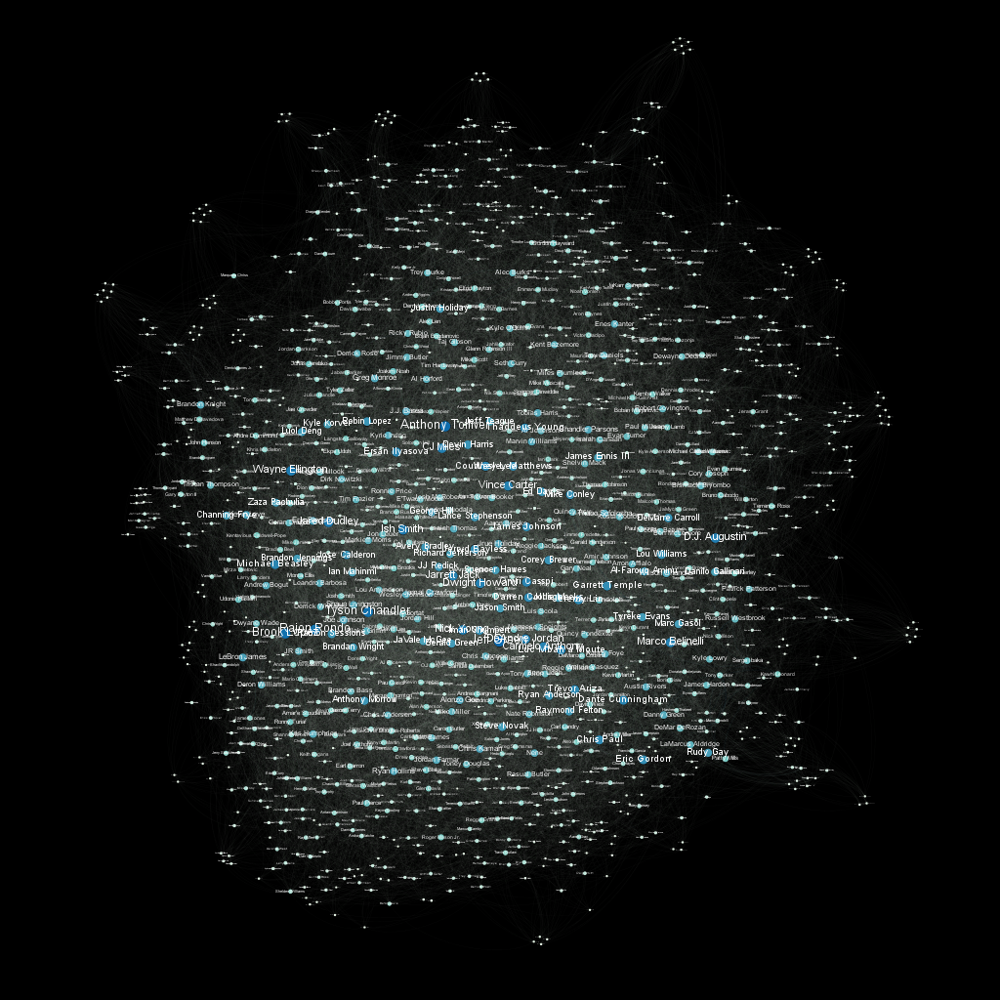
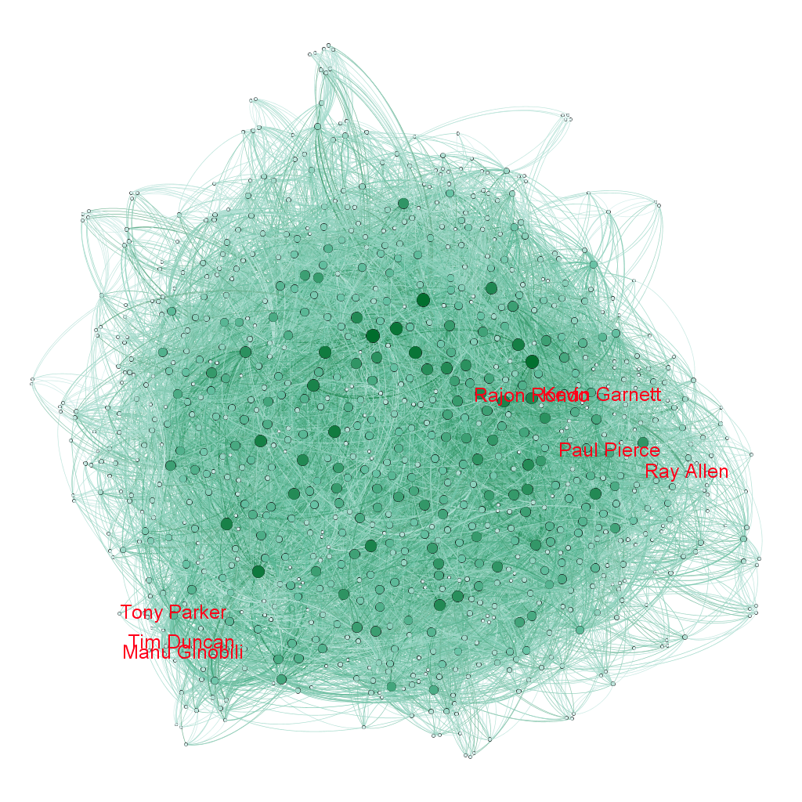

# NBA-players-relation-visualization

Here is a try to make visualization of NBA players (player1 played a year with player 2 during XXXX season in team XXX). From a Kaggle dataset (https://www.kaggle.com/justinas/nba-players-data) the notebook in this repository allows to make a CSV file in which each row is the indication that two players played during a year in the same team. The format can be directly used to get imported in Gephi.

This project was the opportunity to discover the Gephi software, but we will see that the dataset was probably not that appropried because there are no patterns in the transfers, and the 2D space is unable to represent so much teams and so much players.

Here is what we got :

The notebook provides different solutions to discard some of the data, but this doesn't give significant improvement.

We can see that this graph shows the proximity between players who played a lot together (Duncan-Parker-Ginobili or Garnett-Pierce-Allen-Rondo) :

Gephi allows us to find the shortest link from a player to another, and this part could prably be developed. Also, I plan to represent this graph in javascript using : http://sigmajs.org/

Feel free to contact me if you have any note or any question :)
